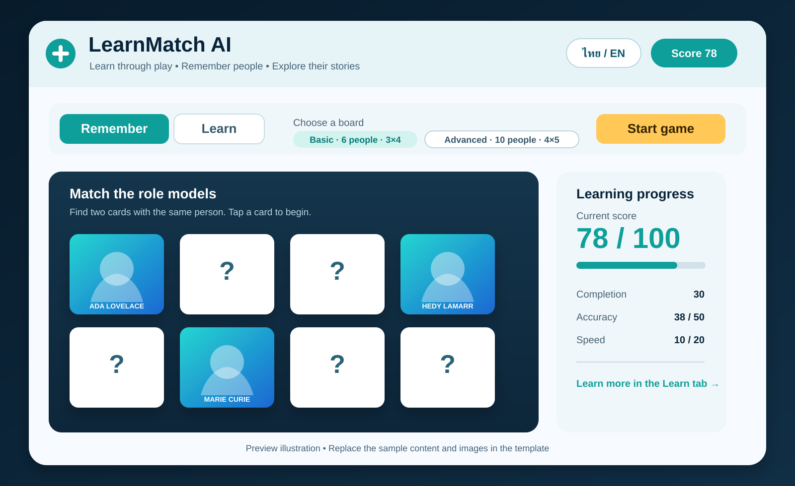
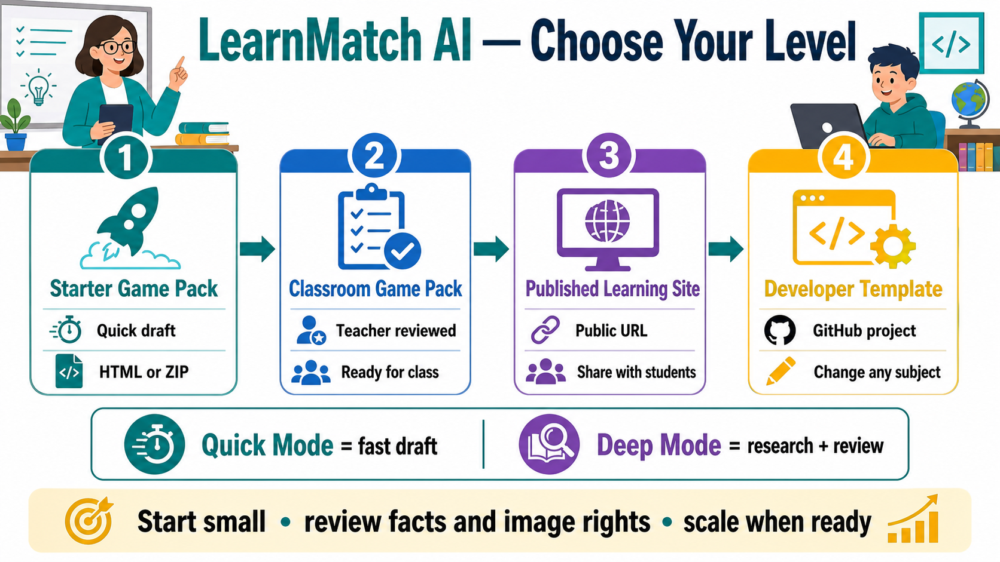

# LearnMatch AI

An AI-adaptable educational memory game template.

LearnMatch AI separates the reusable game engine from its content pack. Teachers can keep the memory game, learning library, bilingual UI, difficulty levels, and 100-point scoring while changing the topic to scientists, athletes, food, technology, AI, or any other classroom subject.

## See the app before you customize it

[Open the published demo](https://memory-match-role-models-4x4.jatosa555.chatgpt.site/) to play the current Thai STEM example.



The preview above shows the Remember/Learn tabs, Basic and Advanced board choices, the Start game button, and the 100-point score panel. It is a static illustration; the published demo is the interactive version.

## Choose a level



The [Level guide](docs/levels.md) explains what each product level produces and which workflow to choose.

## Share with teachers

Use the [Thai LinkedIn post draft](docs/linkedin-post-th.md) to introduce the demo, GitHub Template, levels, and teacher workflow. It includes a ready-to-copy caption, real-image attribution, and the links teachers need to try and extend the project.

## What is included

- Basic: 6 items, 12 cards, 3 x 4 board
- Advanced: 10 items, 20 cards, 4 x 5 board
- Remember and Learn views
- Thai and English content fields
- Score out of 100: completion 30 + accuracy 50 + speed 20
- Source links, image credits, and license fields
- A Thai STEM role-model content pack with safe generated placeholder images as the current example

The code and documentation are written in English for global reuse. The bundled example is Thai on purpose: it demonstrates that the same engine can support localized content. Replace `content/items.json` and the assets when creating a new subject pack.

## Product levels and creation modes

- **Level 1 — Starter Game Pack:** a browser-ready HTML/ZIP output for a quick classroom draft.
- **Level 2 — Classroom Game Pack:** a teacher-reviewed pack ready for classroom use.
- **Level 3 — Published Learning Site:** a reviewed site with source and image-credit records.
- **Level 4 — Developer Template:** a reusable GitHub project for new subjects and languages.

Quick Mode creates a fast draft from teacher-supplied information. Deep Mode researches, cross-checks, and asks for approval before publication. These modes describe the creation workflow; they are not additional product levels.

## Quick start

```bash
npm install
npm run validate:content
npm run dev
```

Open the local URL shown by the development server. Run `npm run lint` and `npm run build` before sharing a release.

## Teacher workflow

1. Copy the starter project or download a release ZIP.
2. Prepare 6 Basic items and 10 Advanced items in the content format.
3. Replace the generated placeholders under `public/assets/placeholders/` with images you have permission to redistribute, then update image credits and licenses in `content/items.json`.
4. Ask ChatGPT to update only the content files using `prompts/quick-mode.md`, or use `prompts/deep-mode.md` for research and review.
5. Review names, facts, sources, image credits, and the preview before sharing.

Quick Mode is designed for a fast draft from teacher-supplied information. Deep Mode asks questions, researches, checks sources and image rights, and waits for teacher approval before publication. AI-generated content is a draft until a teacher approves it.

## Free-friendly output

The free-friendly path produces HTML/ZIP files that can be opened in a browser and shared as files. A public URL is a separate hosting step and is not guaranteed by a ChatGPT account. GitHub is the reusable source template; it is not automatically a published game URL.

## Content files

- `content/items.json`: localized item data, images, facts, and sources
- `content/game-config.json`: difficulty setup and scoring configuration
- `schemas/content.schema.json`: the content contract
- `scripts/validate-content.mjs`: local validation before sharing

Do not change the game engine just to change a topic. Keep subject-specific work inside `content/`, `public/assets/`, and a new folder under `examples/`.

## Image and source responsibility

The public template uses generated placeholders. Replace them only with images you have permission to redistribute or that have a suitable license. Keep an attribution and license record for every image. Wikipedia is a reading source, not automatically an image license. Confirm the source and image rights before publishing a public version.

## Project structure

```text
app/                         Reusable game engine and UI
content/                     Current example content pack
public/assets/               Image assets
examples/                    Additional subject examples
prompts/                     Quick and Deep AI instructions
docs/                        Teacher and developer guides
schemas/                     Content validation contract
scripts/                     Local validation utilities
AGENTS.md                    Optional instructions for coding agents
```

## License

The application code is released under the license in `LICENSE`. Example images and third-party source material may have separate terms; check each asset record before redistribution.


