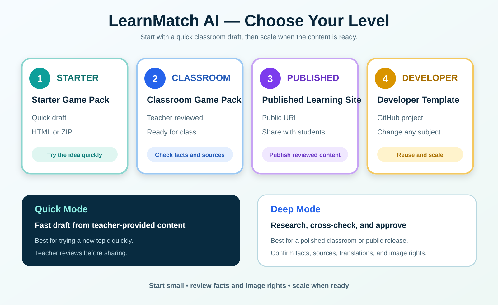

# LearnMatch AI level guide

Use this guide to decide what to make first. A level is the product you deliver; a mode is the way the content is created.

| Level | Product | What the teacher receives | Best for |
| --- | --- | --- | --- |
| Level 1 | Starter Game Pack | Browser-ready HTML or ZIP draft | Trying a topic quickly |
| Level 2 | Classroom Game Pack | Teacher-reviewed content pack | Using it in a real class |
| Level 3 | Published Learning Site | Reviewed public URL | Sharing with students or colleagues |
| Level 4 | Developer Template | Reusable GitHub project | Changing the subject and scaling |

## Choose a creation mode

- **Quick Mode:** provide the topic, people/items, facts, sources, and images. The AI prepares a fast draft. Review it before using it with students.
- **Deep Mode:** answer a few planning questions first. The AI researches and cross-checks facts, translations, sources, and image rights, then waits for approval before publication.

Recommended path: start at Level 1 with Quick Mode, move to Level 2 after teacher review, publish at Level 3 when sources and image rights are ready, and use Level 4 when you want to create many subject packs.

## Current demo

[Play the published Thai STEM demo](https://memory-match-role-models-4x4.jatosa555.chatgpt.site/)

[Open the GitHub Template](https://github.com/jatosa555-creator/learnmatch-ai-template)
